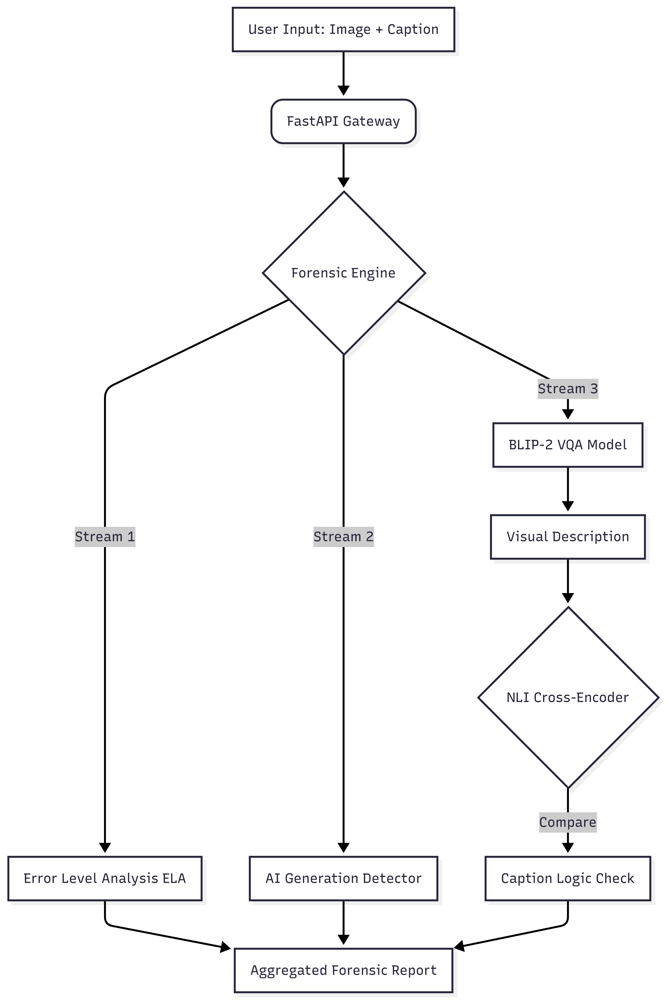

# ClaimTrace: Multimodal AI Forensics

**ClaimTrace** is a media forensics platform designed  to combat misinformation and deepfakes. It utilizes a **multimodal AI pipeline** to cross-reference visual evidence against textual claims, detecting semantic inconsistencies, AI-generated content and digital tampering.


### Capabilities

- **Synthetic Media Detection:** Implements Vision Transformer (ViT) to identify AI-generated imagery.

- **Semantic Consistency Verification:** leverages **BLIP-2 (Vision-Language Model)** to perform Zero-Shot Visual Question Answering (VQA). It "sees" the image context and mathematically compares it against the text caption using **Natural Language Interface (NLI)** cross-encoder.

- **Digital Forensics (ELA)**: Performs **Error Level Analysis** to detect compression anomalies, highlighting regions where pixels have been manually altered or spliced.

- **Hybrid Inference Engine:** Features a device-agnostic architecture that automatically optimizes for **4-bit Quantization on NVIDIA GPUs** or **bfloat16 precision on CPUs**, ensuring deployment flexibility across edge devices and cloud servers.


### System Architecture

The system follows a microservices architecture, containerized for scalibility.

<p align="center">
  
</p>


### Stack

- **Core:** Python 3.11, PyTorch

- **Models:** `Salesforce/blip2-opt-2.7b` (Vision-Language), `cross-encoder/nli-distilroberta-base` (Logic), `umm-maybe/AI-image-detector` (Synthetic Detection).

- **API Framework:** FastAPI

- **Deployment:** Docker

- **Optimization:** `bitsandbytes (4-bit Quantization)`, `accelerate` (Device mapping).


### Quick Start (Docker)

This application is fully containerized to resolve dependency conflicts.


**1. Build the Container**

```bash
docker build -t claimtrace .
```

**2. Run the Forensic Engine**

```bash
docker run -p 8000:8000 claimtrace
```

Access the dashboard at `http://localhost:8000` and the API documentation at `http://localhost:8000/docs`.


### Manual Installation (Local Dev)

For development without Docker:

```bash
git clone https://github.com/ZohaibHassan16/ClaimTrace.git
cd ClaimTrace

python -m venv venv
source venv/bin/activate # Windows: .\venv\Scripts\activate


pip install -r requirements.txt # Use Python -m if on windows


python -m uvicorn app.main:app --reload
```
